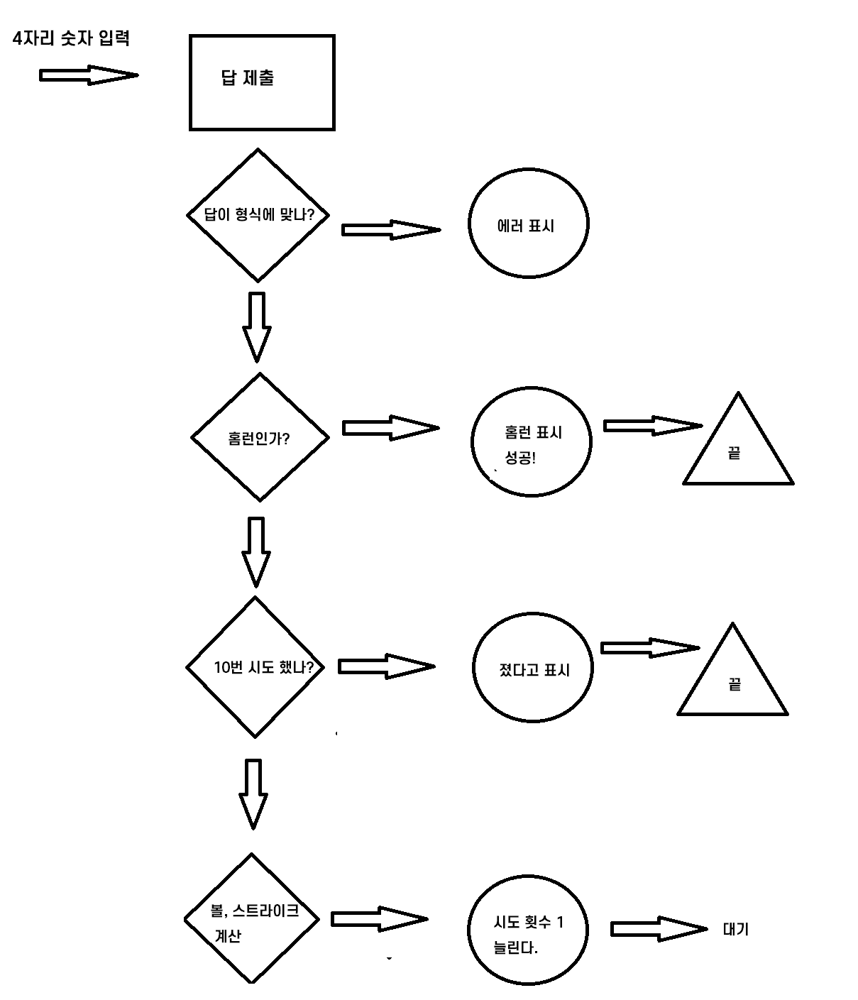

# <h3> 🔗 숫자 야구 순서도



✔️ 배열은 단순히 값들만 모아둘 때, 각각의 값에 속성 이름을 붙여야 할 때는 객체 리터럴 쓰면된다.

🔻배열 메서드와 for문

```javascript
const numbers = [];
for (let n = 1; n <= 9; n += 1) {
  numbers.push(n);
}

(배열 메서드 사용)
const numbers = Array(9).fill().map((v, i) => i + 1);

```

fill()은 배열의 요소로 undefined를 채워 넣는 메서드이고, map은 요소들을 일대일로 짝지어서 다른 값으로 변환하는 메서드이다.
map도 forEach처럼 함수를 인수로 받지만, return 값에 따라 새로운 요소를 반환한다는 점이 다르다.

```javascript
forEach)
const array = [1, 3, 5, 7];
array.forEach((number, index) => {
  console.log(number, index);
});

for)
const array = [1, 3, 5, 7];
for(let i = 0; i < array.length; i++) {
    console.log(array[i], i);
}
```

# <h3> 🔗 forEach와 map

: `forEach`는 반복문 효과를 내는 배열의 메서드이다. 인수로 함수를 넣고, 각각의 배열 요소들에 순서대로 적용된다.

```javascript
const array = [1, 3, 5, 7];
array.forEach((number, index) => {
  console.log(number, index);
});
```

: `map`도 반복문 역할을 하지만, 반환값이 있다는 점에서 forEach와 다르다. map은 기존 배열의 요소를 일대일로 다른 값으로 바꾼다. 단, 기존 배열의 값이 바뀌는 것이 아니라 새로운 배열을 만든다.

```javascript
const array = [1, 3, 5, 7];
const newArray = array.map((number, index) => {
  console.log(number, index);
  return number + 1;
});
console.log(array); // [1, 3, 5, 7]
console.log(newArray); // [2, 4, 6, 8]
```

<hr />

🔗 form
event.target[0], event.target[1] ..
event.target으로 form 안에 태그들에 접근 가능하다.

✔️ 태그 변수들은 $ 붙이거나 변수 이름 뒤에 tag를 붙여 알아보기 쉽게 한다.

# <h3> 🔗 정규 표현식

https://github.com/ziishaned/learn-regex

<hr />

# <h3> 🔗 appen vs appenChild

`document.createElement`, `document.createTextNode`로 만든 태그나 텍스트를 선택한 태그의 자식 태그로 넣는다. `appendChild`로는 하나만 넣을 수 있고, `append`를 사용하면 여러 개를 동시에 넣을 수 있다. 또한, `append`로 텍스트를 추가할 때는 `document.createTextNode` 대신 문자열을 바로 넣어도 된다.

```javascript
const message = document.createTextNode(`패배! 정답은 ${answer.join("")}`);
$logs.appendChild(message);

$logs.append(
  `${value}: ${strike} 스트라이크 ${ball} 볼`,
  document.createElement("br")
);
```

<hr />

# <h3> 🔗 indexOf, includes

: indexOf와 includes는 배열이나 문자열에 원하는 값이 들어 있는지 찾는 메서드이다.
원하는 값이 들어 있다면 해당 인덱스를 알려주고, 들어 있지 않다면 -1을 반환한다.
includes는 조금 더 직관적으로 true/false를 반환.

```javascript
"2345".indexOf(3) === 1;
"2345".indexOf(6) === -1;
["2", "3", "4", "5"].indexOf("5") === 3;
["2", "3", "4", "5"].indexOf(5) === -1; // 요소의 자료형까지 같아야 함
"2345".includes(3) === true;
["2", "3", "4", "5"].includes(5) === false;
```
