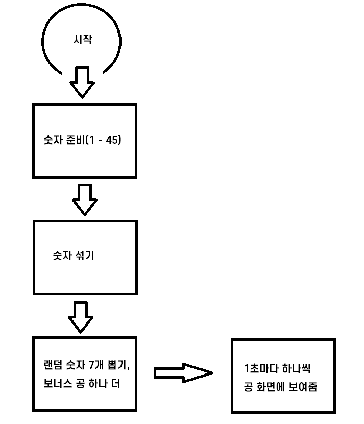

순서도


# <h3> 🔗 콜백 함수

: 함수 안에 파라미터로 들어가는 함수
자바스크립트에서 안정적으로 순차적으로 실행하고 싶을 때 쓴다.
: eventListener

```javascript
document.querySelector(".button").addEventListener("click", function () {
  // 버튼 누르면 이 코드 실행해주세요~ (순차적)
});

setTimeout(function () {
  // 몇 초 후에 이 코드 실행해주세요~
}, s);

- 다른 데서 만든 함수도 콜백 함수로 넣을 수 있다.
document.querySelector(".button").addEventListener("click", 함수명);
```

```javascript
function first(파라미터) {
  second();
}
function second() {}
first(second);
// first 함수 안의 코드 실행해주세요. 근데 파라미터에 second 집어넣어서요
```

[코딩애플 콜백함수]

<hr />

# <h3> 🔗 sort

: return 에 따라 어떻게 정렬할지 나타내준다.
sort는 원본을 바꾼다.

```javascript
// 오름차순
arr.sort((a, b) => {
  return a - b;
});


🔻sort처럼 원본을 바꾸는 경우, 원본이랑 똑같은 것을 복사한 다음 정렬한다.
arr = [1, 2, 3, 4, 5];
arr.slice() // [1, 2, 3, 4, 5]
arr === arr.slice() // false
arr.slice().sort();
```

🔗 문자열 사전순으로 정렬
: `localeCompare()`

```javascript
arr.slice().sort((a, b) => a.localeCompare(b));
```

<hr />

# <h3> 🔗 slice

: 원본에 영향 없이 배열 자르기

```javascript
const array = [3, 2, 1, 7, 8];
array.slice(a, b);

- 매개변수는 인덱스이다.
-인덱스 a는 포함, 인덱스 b는 포함하지 않는다. 즉, 인덱스 a부터 인덱스 b전까지
-원본이 변하지 않는다. 예) map, slice...
```

<hr />

# <h3> 🔗 setTimout

```javascript
setTimeOut(() => {
  // 실행될 함수 자리
}, 시간);
```

<hr />

# <h3> 🔗 closure

🔗 var, let 차이

```javascript
🔻 let -> var로 바꾸면?
for (var i = 0; i < winBalls.length; i++) {
  setTimeout(() => {
    drawBall(winBalls[i], $result);
  }, 1000 * (i + 1));
}
=> 실행이 안된다!
```

변수는 `스코프`라는 범위를 가진다. var는 함수 스코프를 가지고, let은 블록 스코프를 가진다.
스코프 : 변수의 접근 범위

```javascript
함수 스코프
function b() {
    var a = 1;
}
console.log(a);
// Uncaught ReferenceError: a is not defined
```

✔️ a를 콘솔로 출력하면 에러가 발생한다. a는 함수 안에 선언된 변수이므로 함수 바깥에서
접근할 수 없다. 이렇듯 함수를 경계로 접근 여부가 달라지는 것을 `함수 스코프`라고 한다.

✔️ `var`은 함수 스코프(함수만 신경 씀)라서 if 문 안에 들어있으면 바깥에서 접근이 가능하지만,
`if`, `const`는 블록 스코프이기 때문에 블록(if, for문, while문) 블록 안에 있는 let에 접근할 수 없다.

❔ 예제에서 let -> var로 바꿨을 때 실행이 안된 이유는 무엇일까?
: setTimeOut의 콜백 함수 안에 든 i와 바깥의 1000 \* (i + 1)는 다른 시점에 실행된다.

```javascript
🔻 let -> var로 바꾸면?
for (var i = 0; i < winBalls.length; i++) {
  setTimeout(() => {
    drawBall(winBalls[i], $result);
  }, 1000 * (i + 1));
}
=> 실행이 안된다!
```

-반복문은 동기이기 때문에 바로 실행.
1000 \* (i + 1)는 반복문을 돌 때 실행되고, setTimeout의 콜백 함수는 지정한 시간 뒤에 호출된다.
그런데! 반복문은 매우 빠른 속도로 돌아서 콜백 함수가 실행될 때는 이미 i가 6이 되고 난 후..

❔ 그렇다면 let은 왜 되나?
: let은 블록 스코프, 바깥에서 접근하는 것을 막아준다. 반대로 안에 있는 것도 바깥으로 못 나간다.
let은 블록 스코프 안에 고정이 된다.

<hr />

closure를 사용해서 문제를 해결

# <h3> 🔗 closure

: 함수와 함수 바깥에 있는 변수와의 관계
함수 스코프를 가진 variable과 비동기가 만나면 클로저 문제가 발생한다.

```javascript
for (var i = 0; i < winBalls.length; i++) {
  setTimeout(() => {
    drawBall(winBalls[i], $result);
  }, 1000 * (i + 1));
}
=> setTimeout의 함수와 함수 바깥의 for문에서의 i 사이의 문제(함수 외부 변수)

🔻 해결 방법
함수와 함수 바깥의 변수를, 함수와 함수 안에 있는 변수로 바꿔주어야 한다.

for (var i = 0; i < winBalls.length; i++) {
    (function(j) {
        setTimeout(() => {
            drawBall(winBalls[i], $result);
        }, 1000 * (i + 1));
    })(i);
}
```

: 함수 바로 실행하는 방법
function()을 소괄호()로 묶어준 뒤 인자 넘겨준다. (function())();
