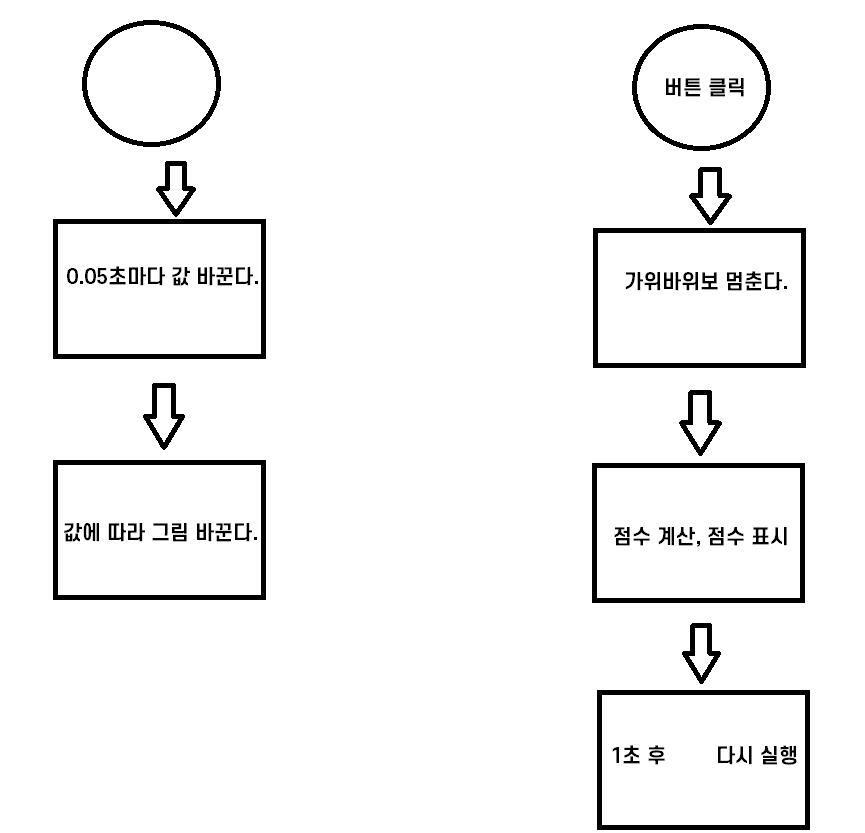

# <h3> 가위바위보 순서도



# <h3> 🔗 setInterval

: setTimeout과 비슷한 효과를 낸다. 단, 한 번만 실행되는 setTimeout과는 달리 지정한 시간마다 주기적으로 지정한 함수를 실행한다.

```javascript
setInterval(() => {
  // 내용
}, 밀리초);
```

🔻setInterval 함수는 반환값이 있다. 반환값은 타이머에 대한 아이디(숫자)로, 이 값을 사용해 타이머를 제거할 수 있다.

```javascript
let 아이디 = setInterval(함수, 밀리초);
clearInterval(아이디);
```

# <h3> 🔗 clearInterval, clearTimeout

: setTimeout -> clearInterval, setTimeout -> clearTimeout 함수로 취소
단, clearTimeout은 setTimeout에 지정한 함수가 아직 실행되지 않았을 때만 취소

```javascript
let 아이디 = setInterval(함수, 밀리초);
clearInterval(아이디);
let 아이디 = setTimeout(함수, 밀리초);
clearTimeout(아이디);
```

<hr />

# <h3> 🔗 배열.includes

: ||을 사용한 코드는 배열의 includes 메서드로 반복을 줄일 수 있다.

```javascript
diff === "바나나" ||
  diff === "사과" ||
  diff ===
    "오렌지"[
      // 또는
      ("바나나", "사과", "오렌지")
    ].includes(diff);
```

<hr />

# <h3> 🔗 removeEventListener 주의할 점

: addEventListener로 연결한 함수를 removeEventListener로 제거할 수 있다. 단, 연결할 떄의 함수와 제거할 때의 함수가 같아야 한다!

```javascript
const fun = (값) => () => {
    console.log('고차함수입니다.', 값);
}

🔻두 메서드에 인수로 넣은 fun(1) 함수를 ===로 비교할 때 true가 나와야 한다. 다른 함수를 넣으면 이벤트가 제거되지 않는다.
태그.addEventListener('click', fun(1));
태그.removeEventListener('click', fun(1));

🔻객체는 생성될 때마다 다른 객체로 본다. 함수도 객체이므로 서로 비교하면 false가 출력된다.
fun(1) === fun(1) // false
```

✅ 고차함수인 fun은 항상 새로운 함수를 반환한다. 같은 함수가 아니므로 이벤트가 제거되지 않는다.
🔻fun(1)을 fun1 변수에 저장해서 같은 함수라는 것을 보장한다.

```javascript
const fun = (값) => () => {
  console.log("고차함수 입니다.", 값);
};

const fun1 = fun(1);
태그.addEventListener("click", fun1);
태그.removeEventListener("click", fun1);
```
